#Library Service 2022

## Update Contents
- TestDataInit 클래스를 통해 샘플 데이터 추가
- Free tier 만료로 인해 EC2와 RDS 연결이 끊어졌습니다. (~June 2023)

---

## Environment & Tools
- Spring boot
- JPA
- JAVA 11
- H2
- JUnit4
- Thymeleaf
- Javascript
- AJAX
- ~~Loaded EC2~~
- ~~Linked up with RDS (MySQL)~~

---

## Functions
###1. User Service

- **게시글을 통해 도서 신청**

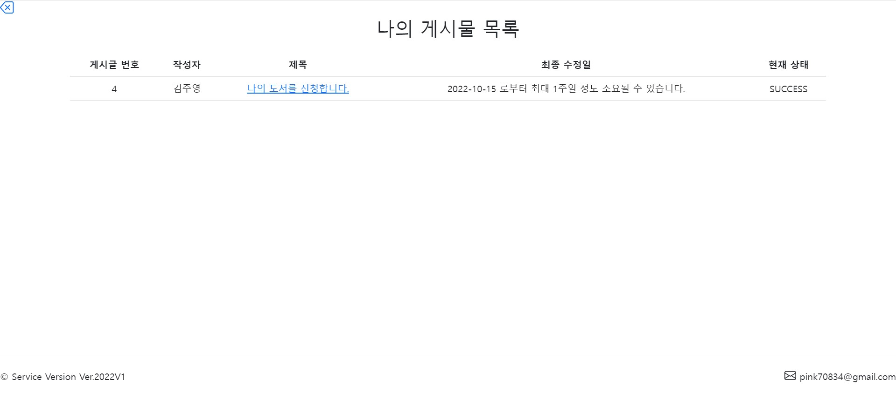

>현재 상태를 표시하여 재고 현황에 따른 신청 결과가 도출됩니다. 
 
>최종 수정일로부터 최대 1주일 정도 소요 시간을 안내하도록 했습니다.

- **댓글 CRUD**

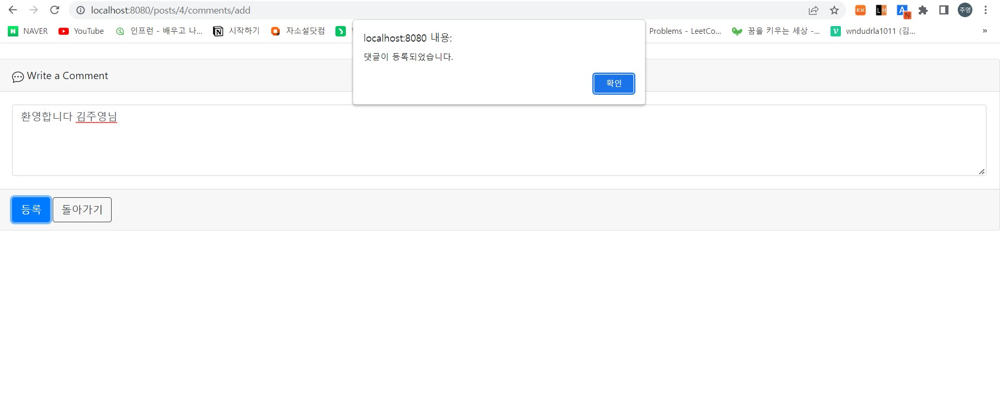 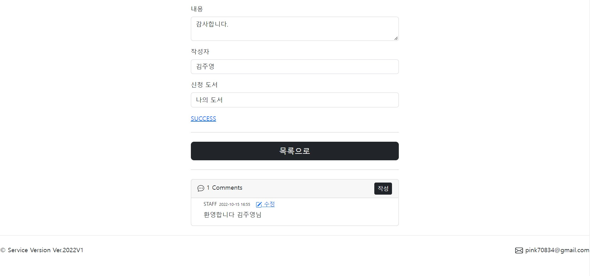

- **나의 정보 CRU**

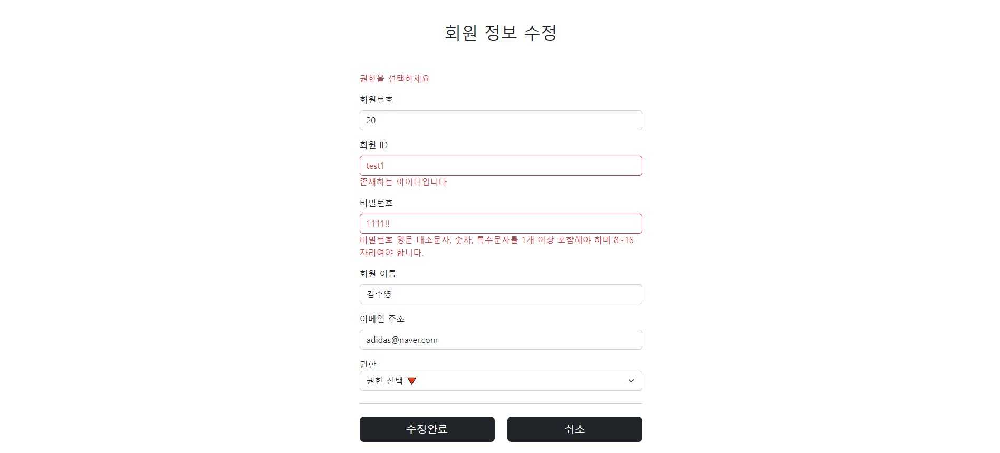

- **파일 업로드 및 다운로드**

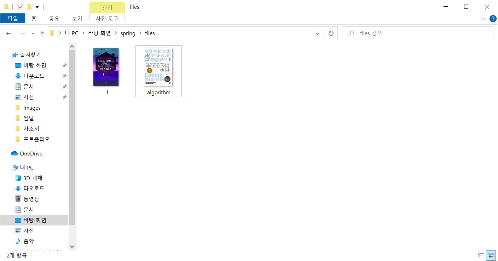

- **입력 정보 검증**

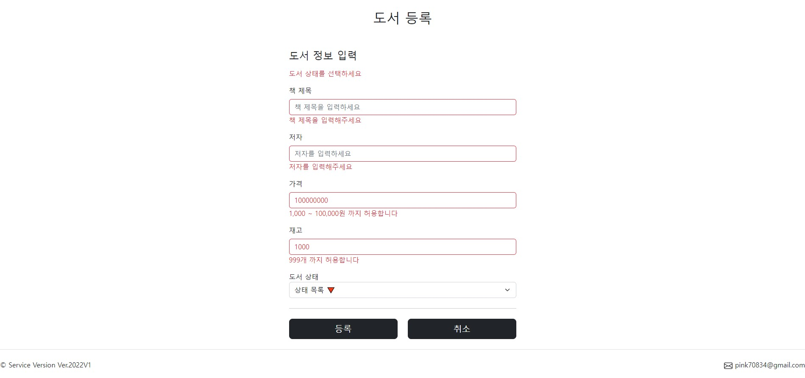

###2. Login Service

- **회원가입**

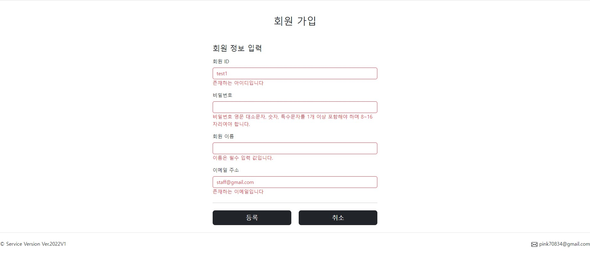

- **로그인**

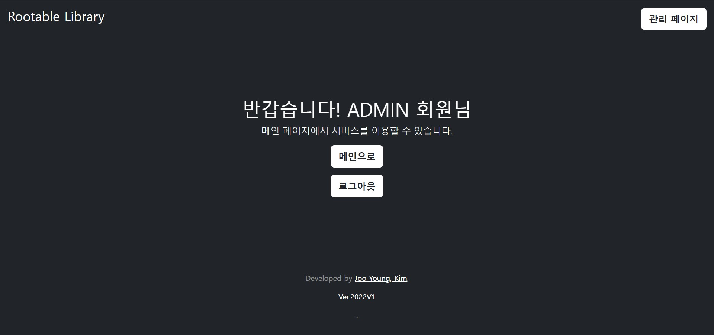

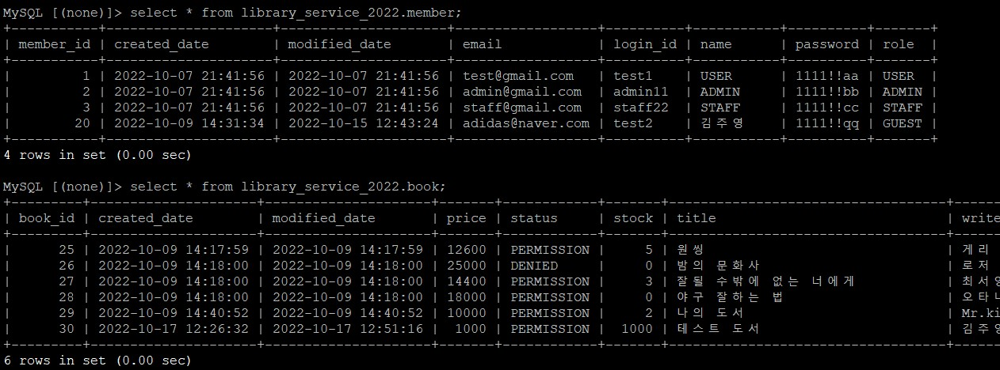

###3. Admin Service (ADMIN or STAFF)

- **회원/도서/게시글/댓글 CRUD**

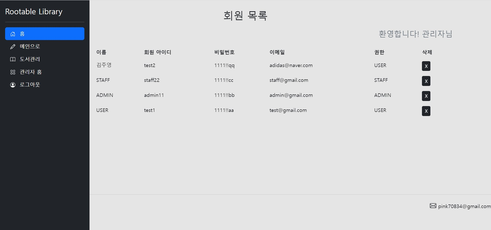

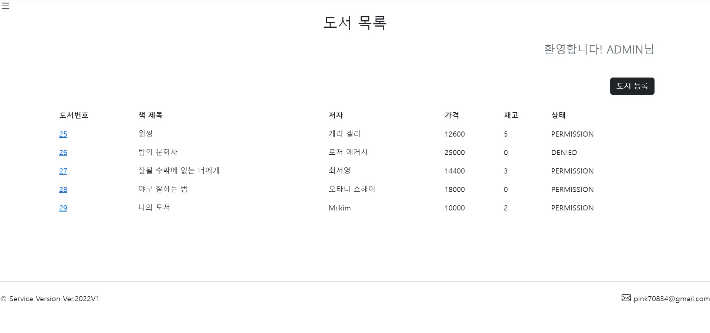

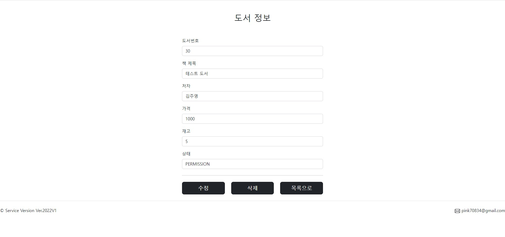

- **권한이 부족한 회원의 접근에 대해 403 커스텀 페이지**

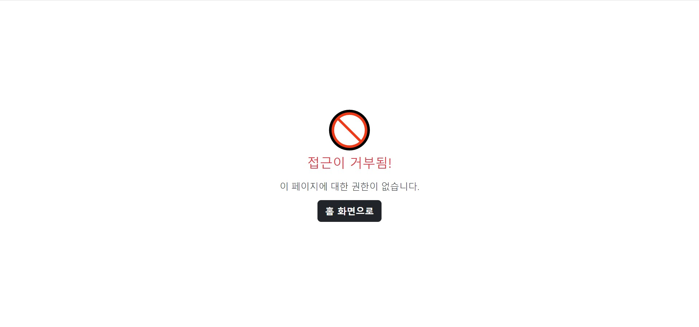

###4. AWS EC2 images (일부 마스킹)

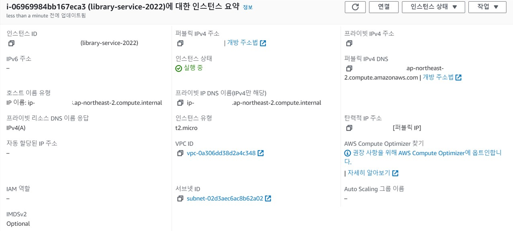

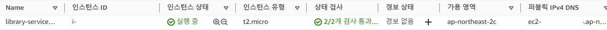

###5.AWS RDS images

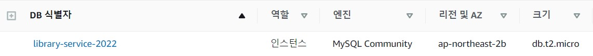

